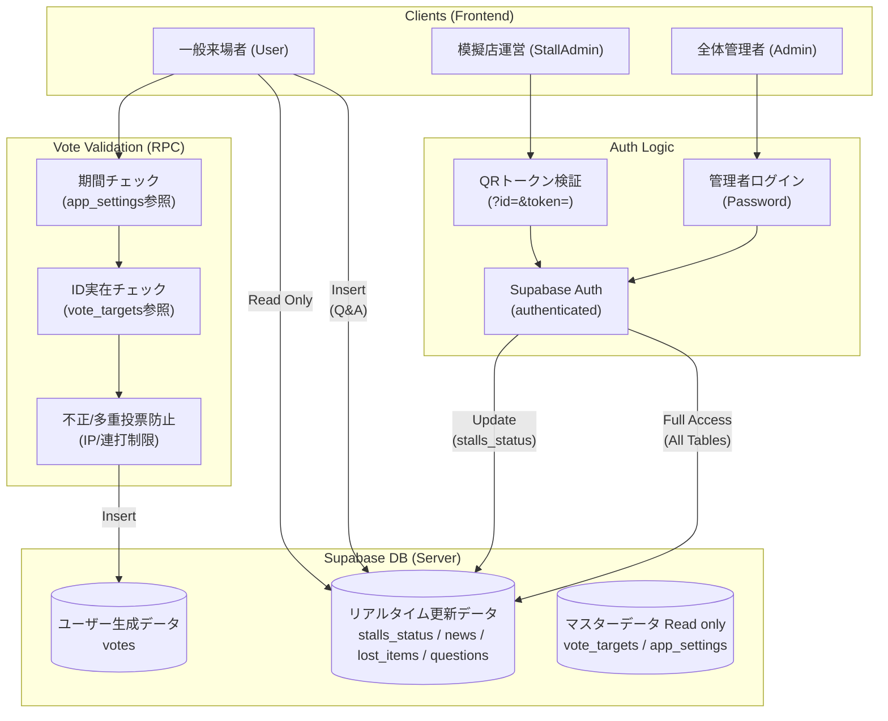
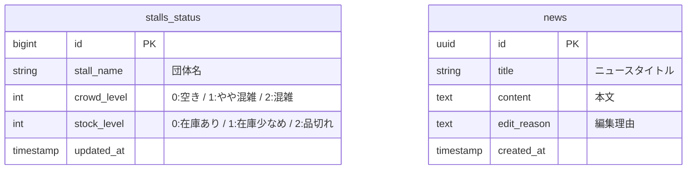
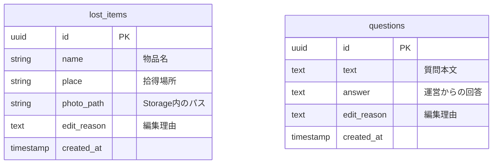
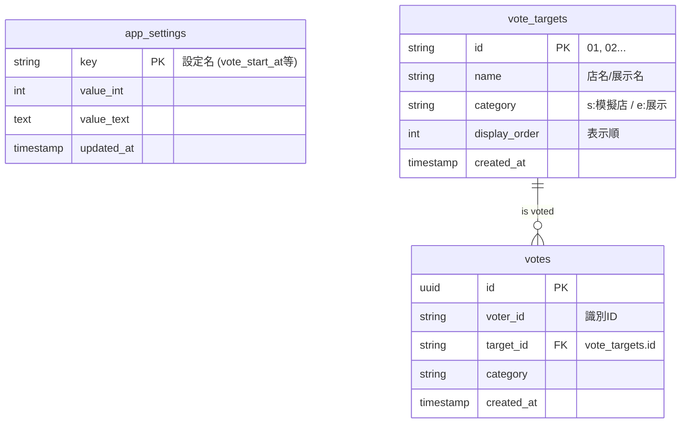

# Supabase 構築とデータ構造

本アプリのバックエンドである Supabase をゼロから再構築するためのガイドです。

## システム構成と権限フロー

本アプリのセキュリティは、フロントエンドのロール管理とバックエンドの RLS (Row Level Security) の組み合わせで成立しています。



## テーブル構成

### 1. リアルタイム更新データ (店舗・状況管理)
模擬店の混雑状況や、運営からの動的な情報を管理するテーブル群です。



### 2. 広報・コミュニケーション (落とし物・Q&A)
来場者とのやり取りや、写真を含む情報を管理するテーブル群です。



### 3. アプリ設定と投票システム
アプリの挙動制御と、リレーションを持つ投票データを管理するテーブル群です。




### Supabaseのapp_settingsテーブル
|Key|役割|デフォルト値|
|--|--|--|
|poll_interval_ms|Realtimeが途切れた時に`get_stalls_only`を実行する間隔　[ミリ秒]|30000|
|vote_start_at|投票開始時刻|2026-05-23 10:00:00+09|
|vote_end_at|投票終了時刻|2026-05-24 15:00:00+09|
|voting_enabled|投票可能フラグ|1|
|maintenance_mode|メンテナンスフラグ|0|

---
## Supabase 構築用 SQL

`SQL/` ディレクトリ内のファイルを以下の順序で実行することで、テーブル、関数、RLS ポリシーが作成されます。

1.  **`generate_full.ts`**: フルセットアップSQLを自動生成(00~06のSQLを連結し、jsonを統合して生成)
2.  **`Full.sql`**: データベースをセットアップするSQL

## 注意点
*   **セキュリティチェック:**
    Supabaseのセットアップ完了後、以下のコマンドを実行してセキュリティ設定（RLSやRPCのバリデーション）が正しく機能しているか確認してください。
    ```bash
    npx tsx --env-file-if-exists=.env src/lib/Misc/audit_security.ts
    ```
    すべてのテストで 「Attack failed」 が表示されれば正常です。もし 「Attack successful」 が表示された場合は、以下の場所を見直してください。

    | テスト ID | 内容 | アタック成功時の見直し場所 |
    | :--- | :--- | :--- |
    | T1 | 期間外の投票 | `vote_for_target` 関数内の時間チェックロジックおよび `app_settings` の値を確認してください。 |
    | T2 | 匿名ユーザーの書き込み | `news` テーブル等の RLS が `ENABLE` になっているか、ポリシーが `TO authenticated` に限定されているか確認してください。 |
    | T3 | ID 偽装 / 連続投票 | `vote_for_target` 関数内の IP 取得ロジック（`x-forwarded-for`）とレート制限インターバルを確認してください。 |
    | T4 | 設定値の不正操作 | `app_settings` テーブルの RLS ポリシー、および匿名更新をブロックする `tr_block_anon_update` トリガーが機能しているか確認してください。 |

